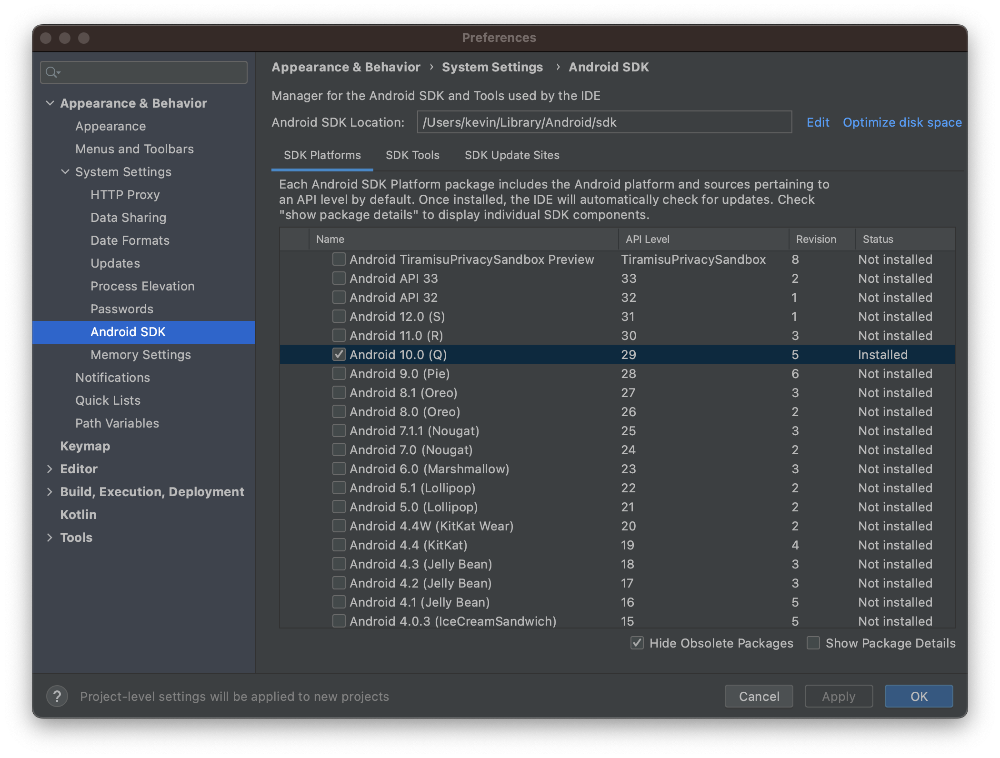
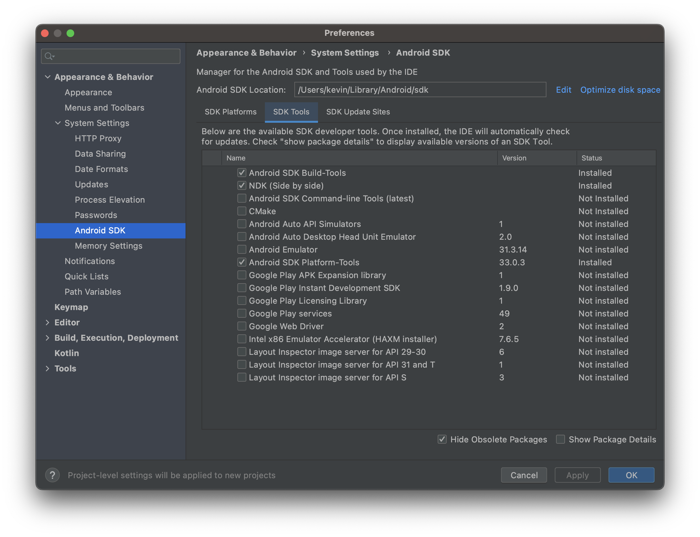

# bevy_xr_app

> Starter Bevy OpenXR App

`bevy_xr_app` is a ready-to-go starter template for using OpenXR with Bevy. It includes basic _scene editor_ support (thanks to `bevy_editor_pls`). It also includes an OpenXR simulator with WASD + Mouse input so you can develop XR applications without putting on a headset.

`bevy_xr_app` is tested on both MacOS and Windows, including the built-in OpenXR simulator. Linux should work but has undergone less testing.

## Simulator Demo

[Simulator Demo](https://user-images.githubusercontent.com/1348691/211132148-c18f81e8-6d03-4a90-95af-b16b33b54020.mp4)


## Compatibility Matrix

|         | Device | PCVR | Quest | Simulator |
| ------- | ------ | ---- | ----- | --------- |
| **OS**  |        |      |       |           |
| MacOS   |        | ✖️   | ✅    | ✅        |
| Windows |        | ✅   | ✅    | ✅        |
| Linux   |        | ❔   | ❔    | ✅        |

## Build Instructions (click to expand)

<details>
<summary><span style="font-size: 20pt;">Simulator</span></summary>

- Make sure the `simulator` feature is enabled. Optionally enable the `editor` feature if desired.
- `cargo run`

</details>

<details>
<summary><span style="font-size: 20pt;">Quest</span></summary>

## Build Dependencies

- Install [Android Stuido](https://developer.android.com/studio). Then install the Android SDK Platform, NDK (Side-by-Side), SDK Build-Tools, and SDK Platform-Tools using the Android Studio SDK Manager. Choose the Android SDK Platform version based on the `target_sdk_version` in `Cargo.toml` (currently 29). Feel free to install the latest version of everything else. See the following screenshots:




- Set the following Environment Variables (macOS example)

```bash
export ANDROID_HOME=$HOME/Library/Android/sdk
export ANDROID_NDK_ROOT=$ANDROID_HOME/ndk/25.1.8937393 # you may have installed a different version, check what is present
export PATH="$ANDROID_HOME/platform-tools:$ANDROID_NDK_ROOT:$PATH"
```

- Install Java for the included `keytool` binary for signing APKs.

  - `brew install openjdk` on macOS

- Download the [Oculus OpenXR Mobile SDK](https://developer.oculus.com/downloads/package/oculus-openxr-mobile-sdk/) and copy `OpenXR/Libs/Android/arm64-v8a/Release/libopenxr_loader.so` to `libs/arm64-v8a` in this project directory.

```bash
cp ~/Downloads/ovr_openxr_mobile_sdk_*/OpenXR/Libs/Android/arm64-v8a/Release/libopenxr_loader.so libs/arm64-v8a
```

- Install `cargo-apk` CLI (`cargo install -f cargo-apk`)

## Running

Run `./android-run.sh` or `./android-run.ps1` depending on your platform.

</details>

<details>
<summary><span style="font-size: 20pt;">PCVR</span></summary>

- Make sure the `simulator` feature is disabled. The `editor` feature may be enabled _or_ disabled.
- `cargo run`

</details>
